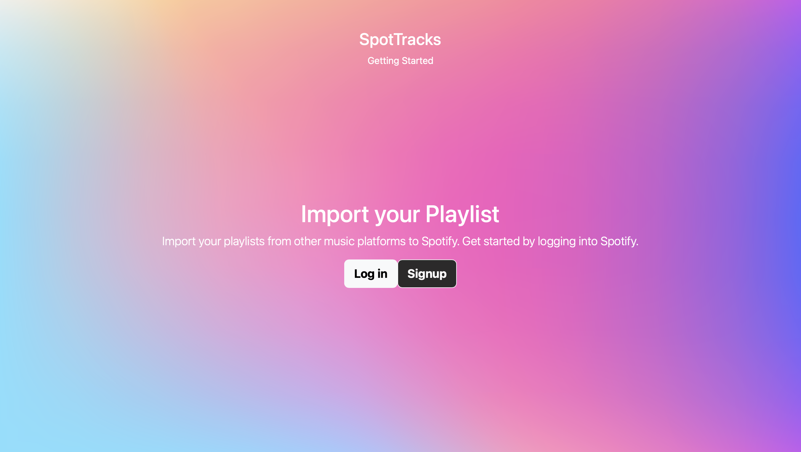
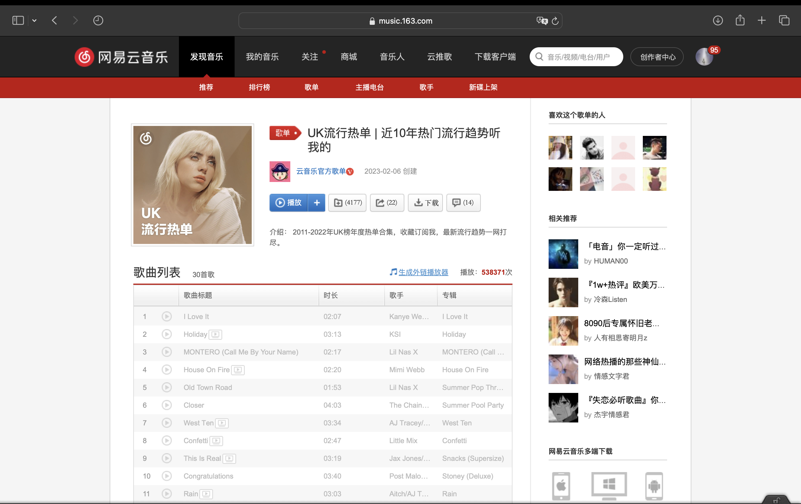

  
  <h2 align="center"><a href="https://spottrack-a13d0.web.app/">SpotTracks</a></h2>
  
Migrate external playlists to Spotify with one click

  

    	
    	
    	
        
        
    	
        

  

Utilizing: [Spotify API](https://developer.spotify.com/documentation/web-api/) and [NeteaseMusic API](https://binaryify.github.io/NeteaseCloudMusicApi/#/)

Currently supporting playlist exporting from Netease Music.

### Tutorial

Go to netease music website at https://music.163.com

Login to your account if needed. (Note that currently only public playlist can be migrated. Change your playlist to public and change it back to private after migration)

Find the desired playlist

Copy the playlist ID from url

Input relevant information and select matching level.

Get the result

